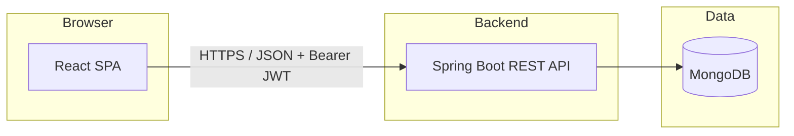
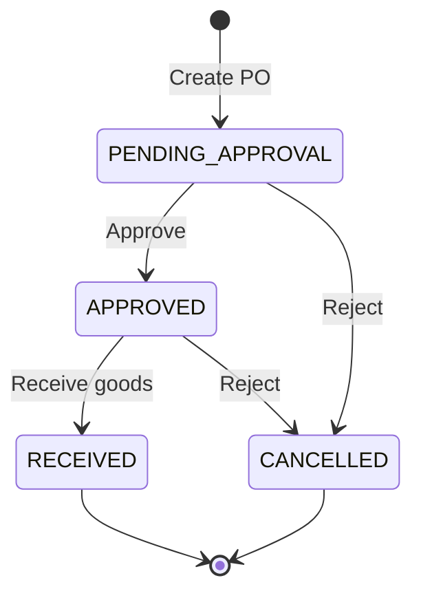
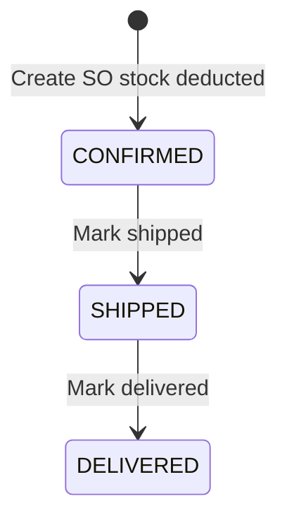

# 📦 Smart Inventory Management System

Full-stack inventory platform: **⚛️ React + Vite** frontend, **🍃 Spring Boot + MongoDB** backend, **🔐 JWT** authentication, and **👥 role-based access** (Staff, Manager, Admin).

This README focuses on **how the application works end-to-end**—the workflows users and the system follow.

---

## 🏗️ High-level architecture



- **🖥️ Frontend** calls `/api/v1/...` (in dev, Vite proxies `/api` to the backend).
- **⚙️ Backend** enforces security, runs business rules, writes **inventory transactions** when stock changes.
- **🍃 MongoDB** stores products, orders, users, ledger rows, notifications, audit logs, etc.

---

## 👥 Roles and what they typically do

| Role | Typical access |
|------|----------------|
| **STAFF** 👤 | View inventory, scan products, ledger, dashboard, notifications; many read-only areas. |
| **MANAGER** 📋 | Everything Staff can do, plus creating/updating **products**, **purchase orders**, **sales orders**, **stock adjustments**, exports, reorder tools. |
| **ADMIN** 🛡️ | Manager capabilities plus **users**, **audit logs**, **settings**, **seed** data, and other restricted operations. |

Exact rules are enforced in the API (`@PreAuthorize` on controllers).

---

## 🔑 Workflow 1: Authentication and session

1. User opens the app and lands on **Login** (unless a token is already in `localStorage`).
2. User submits **username** and **password**.
3. Backend validates credentials and returns a **JWT** 🎫.
4. Frontend stores the token and attaches `Authorization: Bearer <token>` on later requests.
5. If the token expires or the API returns **401** ⛔, the client clears storage and redirects to **Login**.
6. Users can **change password** 🔒 from the sidebar/modal (authenticated endpoint).

**First-time setup:** an admin bootstrap path exists (see `API_ENDPOINTS.md` and `application.properties` for `app.setup.secret`); use only in controlled environments.

---

## 🗂️ Workflow 2: Master data (foundation)

Before day-to-day inventory operations, the catalog and parties should exist:

1. **Categories** 🏷️ — classify products (e.g. Groceries, Toys).
2. **Suppliers** 🚚 — vendors you buy from (needed for purchase orders and **quick PO** on low stock).
3. **Warehouses** 🏭 — optional locations for organizing stock.
4. **Products** 📦 — SKU, name, price, **current quantity**, **reorder level**, optional barcode, links to category/supplier/warehouse.

**Managers/Admins** create and edit these from the UI. **SKU** must be unique. Products drive every other workflow (orders, scan, reports).

---

## 📋 Workflow 3: Inventory list and product detail

1. **Inventory** page loads **paginated** products with optional **search** (name/SKU), **category**, and **warehouse** filters.
2. Clicking a product opens **Product detail** (`/inventory/:id`) for a focused view and related actions (e.g. ledger slice, linked orders—per UI).
3. **Edit** ✏️ opens a modal (role-gated) to update fields; saves go through `PUT /api/v1/products/{id}`.
4. **Bulk actions** 📥 (managers/admins): CSV import and bulk stock **delta** updates as implemented on the Inventory page.

**Stock status** (e.g. STOCKED / LOW / CRITICAL) is derived from **current quantity** vs **reorder level** (and zero stock) in the backend when building responses.

---

## 🔍 Workflow 4: Barcode / SKU scan → Inventory highlight

1. User opens **Scan** (`/scan`).
2. User types or scans **barcode or SKU** and runs **Look up**.
3. Backend resolves the code (`GET /api/v1/products/scan`) and returns product summary + stock status.
4. **View in Inventory** 🔗 navigates to  
   `/inventory?highlight=<productId>`.
5. Inventory loads, resolves the product (clears category/warehouse filters for the deep link, sets search from SKU), **scrolls** to the row, and **highlights** ✨ it briefly; the `highlight` query param is then removed from the URL.

Use this for fast “where is this SKU?” workflows at a desk or with a handheld wedge scanner.

---

## 🛒 Workflow 5: Purchase orders (inbound)

Purchase orders represent **buying stock from a supplier**. Stock increases only when goods are **received**, not when the PO is merely created or approved.



| Step | What happens |
|------|----------------|
| **1️⃣ Create PO** | Manager/Admin picks a **supplier** and line items (product, qty, optional unit price). PO is saved as **PENDING_APPROVAL**. No stock change yet. |
| **2️⃣ Approve** | Status → **APPROVED**. Still **no** stock change (commitment only). |
| **3️⃣ Receive** | Status → **RECEIVED**. For each line, **current quantity** increases; an **IN** row is written to the **inventory ledger** referencing the PO. |
| **4️⃣ Reject / cancel** | From **PENDING_APPROVAL** or **APPROVED**, PO can move to **CANCELLED**. Cannot cancel **RECEIVED** POs. |

Notifications 🔔 and audit entries are recorded on key transitions.

---

## 📤 Workflow 6: Sales orders (outbound)

Sales orders represent **selling to a customer**. In the **current backend implementation**, when a sales order is **created**:

- Stock availability is **checked** (cannot sell more than `currentQuantity`).
- The order is stored as **CONFIRMED** immediately.
- **Stock is deducted** right away, and **OUT** **inventory transactions** are created (ledger).

After that, the order can move through fulfillment **without further stock impact**:



| Step | What happens |
|------|----------------|
| **Create SO** | Lines validated against stock; order **CONFIRMED**; quantities reduced; ledger **OUT** entries. |
| **Mark shipped** 🚚 | Status **SHIPPED** (no stock change). |
| **Mark delivered** ✅ | Status **DELIVERED** (no stock change). |

**Note:** The API still exposes **Confirm** for orders in legacy **PENDING** status (stock deducted on confirm). New orders created by the current service are **CONFIRMED** on create, so the UI **Confirm** action applies mainly to older **PENDING** records if any exist.

---

## ⚠️ Workflow 7: Low stock monitoring and quick purchase

1. **Low Stock Products** (`/low-stock-products`) loads products where quantity is at or below reorder logic (backend `GET /api/v1/products/low-stock`).
2. Each row shows **supplier** (from the product). **Managers/Admins** see **Quick Purchase** ⚡:
   - Enter a **whole-number quantity** (text field with numeric keyboard on mobile).
   - **Create PO** calls `POST /api/v1/purchase-orders` with that **supplier** and a **single line** for that product.
3. The new PO starts in **PENDING_APPROVAL**; follow **Workflow 5** to approve and receive.

If a product has **no supplier**, quick PO is disabled until supplier is set on the product.

---

## 🔄 Workflow 8: Reorder suggestions

**Reorder** (`/reorder-suggestions`) lists products that meet low-stock criteria and suggests **order quantities** using reorder level, safety stock, and current quantity (see `ReorderSuggestionService`). From there, users can initiate procurement flows consistent with the UI (e.g. tied to purchase order creation where implemented).

---

## 📒 Workflow 9: Inventory ledger and adjustments

- **Ledger** lists **inventory transactions** (filters: product, type **IN**/**OUT**, pagination).
- Each transaction records **quantity change**, **quantity after**, **reference** (e.g. `PURCHASE_ORDER`, `SALES_ORDER`), and metadata.
- **Manual adjustments** ✏️ (manager/admin) post to the adjustment endpoint; they update stock and appear on the ledger as appropriate for the implementation.

Use the ledger to **audit** why stock changed.

---

## 📊 Workflow 10: Dashboard and reports

1. **Dashboard** pulls aggregated **stats** (totals, low-stock counts, revenue-style metrics where implemented) and **chart** data (e.g. sales by category, stock breakdown).
2. **Reports** offers date-bounded analytics and **exports** 📥 (CSV / Excel / PDF per backend capabilities).

Revenue and “units sold” style metrics typically count only sales orders in **confirmed/shipped/delivered** states (see `DashboardService` / `ReportsService` for details).

---

## 🔔 Workflow 11: Notifications

- System events (orders, stock updates, etc.) can create **notification** documents for users.
- The UI shows an **unread count** (polled periodically) and a **Notifications** page to read and mark items read.

Optional **email** ✉️ alerts for low stock can be enabled via mail properties (see `application.properties` comments).

---

## ⚡ Workflow 12: WebSockets (real-time)

The backend configures a **STOMP** broker over **WebSocket** with a **SockJS** endpoint (`/ws`) for browser compatibility. The frontend can subscribe to destinations for live updates where integrated (e.g. notification push path). **Production** deployments should align **allowed origins** with real frontend URLs (defaults in config often point at localhost).

---

## 🛡️ Workflow 13: Admin operations

- **Users** — create/update users and roles (admin).
- **Audit logs** 📜 — review sensitive actions (admin).
- **Settings** ⚙️ — key/value configuration (admin).
- **Seed** 🌱 — load demo data from `seed-data.json` (admin, environment-dependent).

---

## 💻 Running locally (short)

**Backend** ☕ (from repo root, Java 17):

```bash
./mvnw spring-boot:run
```

Default API: `http://localhost:8080`  
Profile and Mongo URI: see `src/main/resources/application.properties` and `application-local.properties` (use `application-local-secret.properties` for secrets—do not commit).

**Frontend** (`frontend/`):

```bash
npm install
npm run dev
```

Default UI: `http://localhost:3000` (Vite proxies `/api` to `8080`).

---

## 📚 Further reading

- 📄 **`API_ENDPOINTS.md`** — full REST path reference.
- 📑 **`docs/FINAL_PROJECT_REPORT.md`** — long-form documentation (architecture, appendices).
- 🧪 **`Smart_Inventory_Postman_Collection.json`** — API testing (if present in repo).

---

## ⚖️ License / attribution

Use and adapt per your institution’s requirements; ensure production **secrets**, **MongoDB URIs**, and **JWT keys** are never committed to git.
