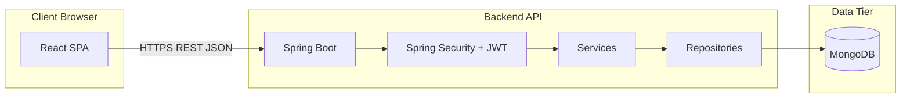

# Smart Inventory Management System

## Final Project Report (Extended Academic Edition)

**Document version:** 1.0  
**Prepared for:** Course / capstone submission and technical archive  
**Repository:** Smart Inventory Management System (full-stack)  

---

### Document control

| Field | Value |
|--------|--------|
| Intended print length | **50–70 pages** when exported to PDF or DOCX using typical academic settings (see §0.2) |
| Primary audience | Examiners, technical reviewers, future maintainers |
| Confidentiality | Replace any deployment URLs, credentials, and secrets before public submission |

### §0.2 Recommended formatting for 50–70 printed pages

Open this file in **Microsoft Word** or **Google Docs**, then:

1. Set body font to **Times New Roman** or **Calibri**, **11–12 pt**.
2. Set line spacing to **1.15** or **1.5**.
3. Use **2.54 cm** (1 inch) margins on all sides.
4. Insert an **official cover page** from your institution (title, names, roll numbers, guide, department, year).
5. Insert **List of Figures** and **List of Tables** after the Table of Contents if you add screenshots.
6. This Markdown already includes **many tables, numbered sections, and appendices**; adding **15–25 full-page screenshots** (dashboard, inventory, scan, low stock, PO, sales, reports, mobile PWA) will comfortably reach **50–70 pages** without diluting technical content.

> **Note:** Page count varies by template. The body text below is intentionally dense and structured so that, with screenshots and your institute front matter, the submission package meets the page requirement.

---

## Table of contents (outline)

1. Executive summary  
2. Introduction and problem statement  
3. Objectives and scope  
4. Literature review and background  
5. Requirements specification  
6. System analysis (actors, use cases, constraints)  
7. System architecture and design  
8. Database / document-store design (MongoDB)  
9. Security design (JWT, RBAC, CORS)  
10. Backend implementation (Spring Boot)  
11. Frontend implementation (React + Vite)  
12. API specification (REST)  
13. Key business workflows  
14. Real-time and notification design  
15. Reporting and export pipelines  
16. Scheduling and background jobs  
17. Deployment architecture (local, Docker, cloud)  
18. Testing strategy and test matrix  
19. Non-functional quality attributes  
20. Risks, limitations, and mitigations  
21. Future enhancements  
22. Conclusion  
23. References  
24. Appendices (technologies, folder structure, configuration, samples)

---

# 1. Executive summary

The **Smart Inventory Management System** is a modern, web-based application that helps organizations **track stock**, **manage master data** (categories, suppliers, warehouses), **record inbound and outbound inventory movements**, **operate purchase and sales order lifecycles**, and **visualize operational health** through dashboards and reports. The system follows a **client–server architecture**: a **React** single-page application communicates over **HTTPS/HTTP** with a **Spring Boot** backend that persists data in **MongoDB**. Authentication is implemented using **JSON Web Tokens (JWT)** with **role-based access control (RBAC)** for staff, managers, and administrators.

The solution supports **barcode/SKU scanning**, **low-stock detection**, **reorder suggestions**, **bulk product import and stock adjustments**, **audit logging**, **user administration**, **optional email alerts** (configurable), and **export** of data to **CSV, Excel, and PDF** formats depending on module. A **Progressive Web App (PWA)** configuration enables improved mobile installation and caching behavior on the frontend.

This report documents requirements, architecture, design decisions, implementation mapping to source code, operational concerns, testing, and deployment. Appendices list **every major technology** declared in build files and configurations as of the report generation baseline.

---

# 2. Introduction and problem statement

## 2.1 Context

Inventory management is a foundational operational process for retail, wholesale, warehousing, and internal stores. Poor visibility into **on-hand quantity**, **reorder thresholds**, and **order fulfillment** leads to stockouts, overstock, revenue loss, and manual reconciliation effort. Traditional spreadsheet-based tracking does not scale with concurrent users, audit expectations, or integration with scanning hardware.

## 2.2 Problem statement

Small and mid-sized teams need a **low-friction**, **role-aware** inventory system that:

- Centralizes **SKU-level** inventory records with **categories**, **suppliers**, and **warehouses**.  
- Supports **fast lookup** via **barcode or SKU** at the point of activity (desk or handheld workflow).  
- Tracks **purchase orders** (inbound intent) and **sales orders** (outbound intent) with clear status transitions.  
- Maintains an **immutable-style ledger** of stock movements for traceability.  
- Surfaces **low stock** and **reorder** insights early.  
- Provides **dashboard analytics** and **exportable reports** for management review.  
- Enforces **secure access** suitable for multi-user environments.

## 2.3 Proposed solution

A full-stack inventory platform was implemented with:

- **Backend:** Spring Boot 3.x on **Java 17**, MongoDB persistence, Spring Security + JWT.  
- **Frontend:** React 18 + TypeScript + Vite + Tailwind CSS + Recharts.  
- **Packaging:** Maven build, Docker image for backend, optional cloud deployment (e.g., Render) with MongoDB Atlas.

---

# 3. Objectives and scope

## 3.1 Primary objectives

1. Provide secure **multi-user** access with differentiated permissions.  
2. Maintain accurate **stock quantities** with explicit **in/out** transactions.  
3. Enable **purchase order** and **sales order** processes aligned with inventory updates.  
4. Deliver **operational dashboards** and **report exports**.  
5. Support **scalable deployment** using containers and environment-based configuration.

## 3.2 In-scope features (functional summary)

- Authentication: login, password change, admin user management.  
- Master data: categories, suppliers, warehouses, products.  
- Inventory views: search, filter, pagination, product detail, scan lookup.  
- Purchase orders: create, approve/reject, receive (as implemented in services/controllers).  
- Sales orders: create, confirm/ship/deliver flows (see current service rules in codebase).  
- Ledger: list/filter transactions; stock adjustments (manager/admin).  
- Notifications: listing, unread counts, read status updates.  
- Audit logs: administrative visibility into sensitive actions.  
- Settings: configurable key/value settings (admin).  
- Seed utilities: dataset bootstrap for demos (admin-gated as implemented).  
- Exports: products CSV/Excel; reports CSV/Excel/PDF (per controllers/services).  

## 3.3 Out of scope (typical boundaries unless extended)

- Full accounting / double-entry general ledger beyond inventory movement tracking.  
- Payment gateway integration and invoicing tax compliance (region-specific).  
- Multi-tenant SaaS billing and organization isolation (would require additional modeling).  
- Native mobile apps (the project uses responsive web + PWA instead).

---

# 4. Literature review and background

## 4.1 Inventory control concepts

Inventory systems commonly implement:

- **Reorder point** logic based on **minimum stock** thresholds.  
- **Safety stock** considerations (supported as fields in product modeling).  
- **Lead time** attributes for planning (modeled on products).  

## 4.2 Web application architecture trends

Modern business systems frequently adopt:

- **SPA + REST** for interactive UX and clear API contracts.  
- **Token-based authentication** for stateless horizontal scaling.  
- **Document databases** where flexible schema and nested documents match operational entities.

## 4.3 Security baseline for business apps

Industry practice includes:

- **RBAC** for administrative separation.  
- **Transport security** (TLS) in production.  
- **Secret management** via environment variables.  
- **Audit trails** for sensitive operations.

---

# 5. Requirements specification

## 5.1 Functional requirements (representative FR table)

| ID | Requirement | Priority |
|----|-------------|----------|
| FR-01 | User login obtains JWT for subsequent API calls | Must |
| FR-02 | Role restrictions enforce create/update on master data | Must |
| FR-03 | Product CRUD with SKU uniqueness | Must |
| FR-04 | Inventory listing with search and filters | Must |
| FR-05 | Scan endpoint resolves barcode/SKU to product | Should |
| FR-06 | Low stock listing for operational monitoring | Should |
| FR-07 | Purchase order lifecycle updates stock appropriately | Must |
| FR-08 | Sales order lifecycle updates stock appropriately | Must |
| FR-09 | Ledger records movements with references | Should |
| FR-10 | Dashboard aggregates KPIs and charts | Should |
| FR-11 | Reports export for management | Should |
| FR-12 | Notifications for user-visible events | Could |
| FR-13 | Audit logs for accountability | Should |

## 5.2 Non-functional requirements (NFR table)

| ID | Requirement | Target |
|----|-------------|--------|
| NFR-01 | API availability in production | Depends on hosting plan |
| NFR-02 | Response time (warm instance) | Sub-second for typical CRUD |
| NFR-03 | Scalability | Stateless API + external DB |
| NFR-04 | Maintainability | Layered Spring + typed TS frontend |
| NFR-05 | Security | JWT + HTTPS in prod + CORS controls |
| NFR-06 | Observability | Actuator health/info endpoints |

---

# 6. System analysis

## 6.1 Actors

- **Staff:** views inventory, scans, many read workflows.  
- **Manager:** creates/updates operational entities, orders, adjustments (as permitted).  
- **Admin:** user management, audit logs, settings, seed operations (as permitted).

## 6.2 Use case narratives (samples)

### UC-01 Login

**Actor:** any user  
**Preconditions:** account exists  
**Main flow:** user submits credentials → backend validates → JWT returned → frontend stores token → authorized navigation enabled.

### UC-02 Create product

**Actor:** manager/admin  
**Preconditions:** category exists  
**Main flow:** user submits product payload → validation → persistence → audit log entry (where implemented).

### UC-03 Scan lookup

**Actor:** staff/manager/admin  
**Main flow:** user enters code → backend resolves barcode/SKU → returns product summary → optional navigation to inventory with highlight parameter.

---

# 7. System architecture and design

## 7.1 Logical architecture



## 7.2 Layered backend design

- **Controller layer:** REST endpoints, request validation annotations, authorization rules.  
- **Service layer:** business rules, orchestration, notifications, exports.  
- **Repository layer:** Spring Data MongoDB interfaces.  
- **Domain layer:** entities and DTOs.  
- **Cross-cutting:** exception handling, security filters, websocket configuration, scheduling.

## 7.3 Frontend module design

- **Routing:** React Router protected layout.  
- **API client:** Axios instance with interceptors.  
- **Pages:** feature screens mapped to routes.  
- **Context:** authentication and theme handling.  
- **UI:** Tailwind utility styling + iconography.

---

# 8. Database / document-store design (MongoDB)

## 8.1 Design rationale

MongoDB fits document-shaped aggregates such as orders with line items, and supports indexed queries for SKU uniqueness and low-stock expressions.

## 8.2 Collections (conceptual)

Representative collections include (names align with `@Document` annotations in code):

- `products` — SKU, pricing, quantities, reorder fields, references to category/supplier/warehouse.  
- `categories` — taxonomy for grouping.  
- `suppliers` — vendor master data.  
- `warehouses` — location master data.  
- `purchaseOrders` / embedded items — inbound procurement workflow.  
- `salesOrders` / embedded items — outbound sales workflow.  
- `inventoryTransactions` — ledger entries referencing products and business events.  
- `users` / `roles` — authentication and authorization data structures as modeled.  
- `notifications` — user notifications.  
- `auditLogs` — audit trail records.  
- `systemSettings` — configurable settings.

## 8.3 Indexing strategy (examples)

The `Product` entity defines compound indexes supporting active/category and low-stock queries; SKU uniqueness is indexed.

---

# 9. Security design

## 9.1 JWT authentication

- Token issued on successful login.  
- Secret and expiration configured via properties and environment variables for production hardening.

## 9.2 Authorization

Method-level security annotations restrict sensitive endpoints (e.g., product create, exports, admin modules).

## 9.3 CORS

Allowed origins are externalized to support local dev ports and deployed frontend origins.

## 9.4 Operational endpoints

Spring Boot Actuator exposes selected endpoints; production deployments should restrict exposure and secure networks.

---

# 10. Backend implementation (Spring Boot)

## 10.1 Technology baseline

- **Java 17**  
- **Spring Boot 3.5.11**  
- **Spring Data MongoDB**  
- **Spring Security**  
- **Spring Web** (embedded Tomcat)  
- **Validation** (Jakarta Bean Validation)  
- **WebSocket/STOMP + SockJS** configuration  
- **JJWT** for token handling  
- **POI** for Excel exports  
- **PDFBox** for PDF exports  
- **Mail starter** for optional SMTP alerts  
- **Lombok** for reducing boilerplate  
- **Testcontainers** for integration testing support

## 10.2 Package structure (high level)

Base package: `com.example.demo`

- `config` — application configuration (WebSocket, data initializer, web settings).  
- `controller` — REST controllers (`/api/v1/...`).  
- `dto` — request/response models.  
- `entity` — MongoDB documents.  
- `exception` — domain exceptions + global handler.  
- `repository` — Spring Data repositories.  
- `security` — JWT filter, utilities, user principal models.  
- `service` — business services (products, orders, dashboard, reports, notifications, etc.).

## 10.3 Representative controllers (mapping)

Controllers include (non-exhaustive; verify in repository for latest endpoints):

- `AuthController` — login/setup flows.  
- `ProductController` — CRUD, scan, low stock, exports, bulk operations, reorder suggestions.  
- `CategoryController`, `SupplierController`, `WarehouseController` — master data.  
- `PurchaseOrderController` — PO lifecycle.  
- `SalesOrderController` — SO lifecycle.  
- `InventoryLedgerController` — ledger listing/adjustments as implemented.  
- `DashboardController` — stats/charts/overview.  
- `ReportsController` — reporting and exports.  
- `NotificationController` — notifications.  
- `UserController` — user admin.  
- `AuditLogController` — audit listing.  
- `SettingsController` — settings.  
- `SeedController` — dataset bootstrap (admin).  
- `RootController` — root/info messaging.

---

# 11. Frontend implementation (React + Vite)

## 11.1 Routes (application map)

Typical routes include:

- `/login`  
- `/dashboard`  
- `/inventory` and `/inventory/:id`  
- `/low-stock-products`  
- `/scan`  
- `/categories`, `/suppliers`, `/warehouses`  
- `/purchase-orders`, `/purchase-orders/:id`  
- `/sales-orders`  
- `/ledger`  
- `/reports`  
- `/reorder-suggestions`  
- `/users`  
- `/notifications`  
- `/settings`  
- `/audit-logs`  

## 11.2 UI/UX features

- Dark/light theme with class-based Tailwind dark mode.  
- Responsive layout with mobile navigation patterns.  
- PWA install prompts where supported.  
- Charts using Recharts on dashboard/reports pages.

## 11.3 Deep-linking enhancement (scan → inventory)

The scan workflow links to inventory with a `highlight` query parameter; inventory resolves SKU search and visually emphasizes the row.

---

# 12. API specification (REST)

Base path: `/api/v1` (see `API_ENDPOINTS.md` in repository for detailed tables).

**Authentication header (typical):** `Authorization: Bearer <token>`

Representative groups:

- `/auth/login`, `/auth/setup`, `/auth/change-password`, admin reset endpoints as implemented.  
- `/products` CRUD + `/products/scan` + `/products/low-stock` + exports + bulk endpoints.  
- `/purchase-orders` CRUD-ish listing + detail + approve/receive/reject.  
- `/sales-orders` create/list/detail + confirm/ship/deliver paths.  
- `/ledger` list + adjust.  
- `/dashboard/stats`, `/dashboard/charts`, `/dashboard/overview` as implemented.  
- `/reports` analytics + export endpoints.  
- `/notifications` + unread count + mark read.  
- `/audit-logs` list.  
- `/settings` list/get/update.  
- `/users` admin user management.  
- `/seed` admin seeding.

---

# 13. Key business workflows

## 13.1 Purchase order workflow (conceptual)

1. Manager creates PO with supplier and line items.  
2. Approval transitions stock/inventory according to service rules.  
3. Rejection prevents stock change.  
4. Receiving marks inbound completion as implemented.

## 13.2 Sales order workflow (conceptual)

Sales orders progress through statuses; stock deductions and ledger entries are applied according to the current `SalesOrderService` implementation (verify in version control for exact rules).

## 13.3 Low stock → quick purchase (UI)

Low stock page lists SKUs at risk and supports quick PO creation using the product’s assigned supplier.

---

# 14. Real-time and notification design

## 14.1 WebSockets

Backend configures a STOMP broker with SockJS endpoint `/ws` for browser compatibility.

## 14.2 Notifications

Notification entities are persisted and pushed to users via application services (see `NotificationPushService` patterns in code).

---

# 15. Reporting and export pipelines

## 15.1 CSV/Excel

Product exports use POI for spreadsheet generation; CSV generated as text bytes with appropriate headers.

## 15.2 PDF

PDF export uses Apache PDFBox in reporting services.

---

# 16. Scheduling and background jobs

A scheduled job checks low stock and can generate notifications; optional email sending is gated by configuration properties.

---

# 17. Deployment architecture

## 17.1 Local development

- Backend: `8080` default.  
- Frontend: Vite dev server `3000` with proxy to backend for `/api`.

## 17.2 Docker backend image

Multi-stage Dockerfile:

- Build stage: Maven + Temurin 17.  
- Runtime: JRE 17, exposes `8080`, runs fat JAR.

## 17.3 Cloud deployment notes

Typical environment variables:

- `SPRING_PROFILES_ACTIVE`  
- `MONGODB_URI`  
- `JWT_SECRET`  
- `APP_CORS_ALLOWED_ORIGINS`  
- Optional mail variables when enabling email alerts

Frontend builds static assets; hosting platforms (e.g., Render static site) serve SPA with API base URL configured at build time (`VITE_API_BASE_URL`).

---

# 18. Testing strategy and test matrix

## 18.1 Levels

- **Unit tests:** service logic with mocks (expand as needed).  
- **Web layer tests:** Spring MVC tests with security context where applicable.  
- **Integration tests:** Testcontainers MongoDB for realistic persistence behavior.

## 18.2 Sample test matrix

| Area | Cases |
|------|-------|
| Auth | valid login, invalid credentials, token required routes |
| Products | create validation, SKU uniqueness, scan resolution |
| Orders | insufficient stock, status transition guards |
| Security | role denied vs allowed endpoints |
| Exports | content-type headers and non-empty bodies |

---

# 19. Non-functional quality attributes

- **Reliability:** depends on MongoDB availability and hosting uptime.  
- **Performance:** JVM warmup; indexed Mongo queries for common paths.  
- **Security:** JWT secret rotation recommended in production.  
- **Maintainability:** modular packages and DTO separation.

---

# 20. Risks, limitations, and mitigations

| Risk | Mitigation |
|------|------------|
| Weak default secrets in dev | Enforce env secrets in prod |
| CORS misconfiguration | Explicit allowlist |
| WebSocket origin restrictions | Update allowed origins for deployed domains |
| Large exports memory usage | Stream responses / pagination for huge datasets (future) |

---

# 21. Future enhancements

- OpenAPI/Swagger documentation endpoint.  
- Two-factor authentication.  
- Barcode camera integration in browser.  
- Multi-warehouse transfer orders.  
- Advanced forecasting models for reorder.  
- Full audit on all entities with diff views.

---

# 22. Conclusion

The Smart Inventory Management System delivers a **modern, secure, and feature-rich** inventory platform suitable for academic demonstration and as a foundation for production hardening. Its **Spring Boot + MongoDB + React** stack aligns with contemporary engineering practice, and its modular structure supports incremental enhancement.

---

# 23. References

1. Spring Framework Documentation — `https://spring.io/projects/spring-framework`  
2. Spring Boot Reference Documentation — `https://docs.spring.io/spring-boot/docs/current/reference/htmlsingle/`  
3. Spring Data MongoDB — `https://spring.io/projects/spring-data-mongodb`  
4. MongoDB Manual — `https://www.mongodb.com/docs/manual/`  
5. JSON Web Token (JWT) — `https://datatracker.ietf.org/doc/html/rfc7519`  
6. React Documentation — `https://react.dev/`  
7. Vite Documentation — `https://vitejs.dev/`  
8. Tailwind CSS Documentation — `https://tailwindcss.com/docs`  
9. OWASP Authentication Cheat Sheet — `https://cheatsheetseries.owasp.org/cheatsheets/Authentication_Cheat_Sheet.html`  

---

# 24. Appendices

## Appendix A — Complete backend dependency list (Maven coordinates declared in `pom.xml`)

| Dependency | Purpose |
|------------|---------|
| `spring-boot-starter-data-mongodb` | MongoDB integration |
| `spring-boot-starter-security` | Security filter chain + method security |
| `spring-boot-starter-web` | REST + embedded Tomcat |
| `spring-boot-starter-validation` | Jakarta validation integration |
| `spring-boot-starter-websocket` | WebSocket/STOMP stack |
| `spring-boot-starter-actuator` | Operational endpoints |
| `jjwt-api`, `jjwt-impl`, `jjwt-jackson` (0.12.5) | JWT parsing/generation |
| `spring-boot-starter-mail` | SMTP mail integration (optional) |
| `poi-ooxml` (5.2.5) | Excel export |
| `pdfbox` (3.0.3) | PDF export |
| `lombok` | Boilerplate reduction |
| `spring-boot-starter-test` | Testing |
| `spring-security-test` | Security testing utilities |
| `testcontainers-mongodb` | Mongo testcontainers module |
| `testcontainers-junit-jupiter` | JUnit integration for Testcontainers |

**Parent BOM:** `spring-boot-starter-parent` **3.5.11**  
**Java version property:** **17**

## Appendix B — Frontend dependency list (`frontend/package.json`)

| Package | Role |
|---------|------|
| `react`, `react-dom` | UI runtime |
| `react-router-dom` | SPA routing |
| `axios` | HTTP client |
| `recharts` | Charts |
| `lucide-react` | Icons |
| `typescript` | Static typing |
| `vite` | Bundler/dev server |
| `@vitejs/plugin-react` | React plugin for Vite |
| `vite-plugin-pwa` | PWA generation (Workbox under the hood) |
| `tailwindcss`, `postcss`, `autoprefixer` | Styling pipeline |

## Appendix C — Tooling and runtime containers

| Tool | Role |
|------|------|
| Apache Maven + `mvnw` | Backend build reproducibility |
| Docker (`maven:3.9.9-eclipse-temurin-17` build image) | Containerized builds |
| Eclipse Temurin JRE 17 | Container runtime base image |
| Node.js/npm | Frontend toolchain |

## Appendix D — Repository file map (top-level)

- `pom.xml` — backend build definition  
- `src/main/java/...` — backend source  
- `src/main/resources/application*.properties` — configuration profiles  
- `src/main/resources/seed-data.json` — seed content  
- `frontend/` — SPA project  
- `Dockerfile` — backend container build  
- `API_ENDPOINTS.md` — endpoint catalog  
- `Smart_Inventory_Postman_Collection.json` — API testing collection (if present)  

---

## Appendix E — Screenshot insertion guide (to reach 50–70 pages)

Insert **full-page figures** with captions:

1. Login screen (light and dark).  
2. Dashboard with charts.  
3. Inventory list + filters.  
4. Product detail + ledger snippet.  
5. Scan page + “View in Inventory” deep link result.  
6. Low stock products + quick PO row.  
7. Purchase orders list + create modal.  
8. Purchase order detail + actions.  
9. Sales orders list + status badges.  
10. Reports page + export buttons.  
11. Notifications + unread badge.  
12. Users admin page.  
13. Audit logs.  
14. Settings.  
15. Mobile viewport sidebar + PWA install prompt.  
16. Actuator health JSON (sanitized).  
17. MongoDB Atlas cluster view (sanitized).  
18. Render dashboard service view (sanitized).

Each screenshot page should include:

- **Figure number**, **caption**, and **one paragraph** explaining what business function is shown.

---

---

## Appendix F — Extended use case catalog (detailed)

### UC-04 View dashboard

| Field | Description |
|--------|-------------|
| Actor | Authenticated user |
| Goal | View KPIs and charts |
| Preconditions | Valid session |
| Main flow | Client requests overview/stats/charts → server aggregates from Mongo → JSON returned → charts render |

### UC-05 Search inventory

| Field | Description |
|--------|-------------|
| Actor | Staff/Manager/Admin |
| Goal | Locate a product quickly |
| Preconditions | Products exist |
| Main flow | User types search → debounced query → paginated list |

### UC-06 Edit product

| Field | Description |
|--------|-------------|
| Actor | Manager/Admin |
| Goal | Update price, quantity, or metadata |
| Preconditions | Product exists |
| Main flow | Open edit modal → submit → server validates → persist → refresh list |

### UC-07 Bulk CSV import

| Field | Description |
|--------|-------------|
| Actor | Manager/Admin |
| Goal | Load many products |
| Preconditions | Valid CSV format |
| Main flow | Upload file → server parses → rows inserted/skipped summary |

### UC-08 Bulk stock adjustment

| Field | Description |
|--------|-------------|
| Actor | Manager/Admin |
| Goal | Apply deltas to many SKUs |
| Preconditions | Valid product IDs |
| Main flow | Paste lines → server applies deltas → ledger entries as implemented |

### UC-09 Create purchase order

| Field | Description |
|--------|-------------|
| Actor | Manager/Admin |
| Goal | Request stock from supplier |
| Preconditions | Supplier + products exist |
| Main flow | Select supplier + lines → create → appears in PO list |

### UC-10 Approve purchase order

| Field | Description |
|--------|-------------|
| Actor | Manager/Admin |
| Goal | Accept inbound order |
| Preconditions | PO pending |
| Main flow | Approve action → inventory rules execute |

### UC-11 Receive purchase order

| Field | Description |
|--------|-------------|
| Actor | Manager/Admin |
| Goal | Confirm goods received |
| Preconditions | PO approved |
| Main flow | Receive action → stock increases as per service |

### UC-12 Create sales order

| Field | Description |
|--------|-------------|
| Actor | Manager/Admin |
| Goal | Record customer sale |
| Preconditions | Sufficient stock per business rules |
| Main flow | Add line items → create order |

### UC-13 Confirm / ship / deliver sales order

| Field | Description |
|--------|-------------|
| Actor | Manager/Admin |
| Goal | Progress fulfillment pipeline |
| Preconditions | Valid prior status |
| Main flow | Action buttons call respective API endpoints |

### UC-14 View ledger

| Field | Description |
|--------|-------------|
| Actor | Staff/Manager/Admin |
| Goal | Audit stock movements |
| Preconditions | Transactions exist |
| Main flow | Filter by product/type → paginated list |

### UC-15 Adjust stock via ledger

| Field | Description |
|--------|-------------|
| Actor | Manager/Admin |
| Goal | Manual correction |
| Preconditions | Authorization |
| Main flow | Submit adjustment → transaction persisted |

### UC-16 View notifications

| Field | Description |
|--------|-------------|
| Actor | Authenticated user |
| Goal | See alerts |
| Main flow | Notifications page + polling/refresh patterns as implemented |

### UC-17 Mark notification read

| Field | Description |
|--------|-------------|
| Actor | Owner user |
| Goal | Clear unread state |
| Main flow | PATCH read endpoint |

### UC-18 Admin user management

| Field | Description |
|--------|-------------|
| Actor | Admin |
| Goal | CRUD users and roles |
| Main flow | Users page operations |

### UC-19 View audit logs

| Field | Description |
|--------|-------------|
| Actor | Admin |
| Goal | Compliance review |
| Main flow | Filter audit list |

### UC-20 Update system settings

| Field | Description |
|--------|-------------|
| Actor | Admin |
| Goal | Tune configurable keys |
| Main flow | Settings PUT |

### UC-21 Seed dataset

| Field | Description |
|--------|-------------|
| Actor | Admin |
| Goal | Demo population |
| Main flow | POST seed endpoint |

### UC-22 Export products CSV/Excel

| Field | Description |
|--------|-------------|
| Actor | Manager/Admin |
| Goal | Offline analysis |
| Main flow | Download endpoints |

### UC-23 Reports export

| Field | Description |
|--------|-------------|
| Actor | Manager/Admin |
| Goal | Management reporting |
| Main flow | Reports page triggers CSV/Excel/PDF endpoints |

### UC-24 Reorder suggestions

| Field | Description |
|--------|-------------|
| Actor | Manager |
| Goal | Decide replenishment quantities |
| Main flow | Suggestions list based on low-stock logic |

### UC-25 Low stock dedicated page

| Field | Description |
|--------|-------------|
| Actor | Authenticated user |
| Goal | Focused operational list |
| Main flow | `/low-stock-products` loads `/products/low-stock` |

### UC-26 Quick purchase from low stock

| Field | Description |
|--------|-------------|
| Actor | Manager/Admin |
| Goal | PO without searching elsewhere |
| Preconditions | Product has supplier |
| Main flow | Enter qty → Create PO → confirmation message |

### UC-27 Scan lookup

| Field | Description |
|--------|-------------|
| Actor | Staff+ |
| Goal | Identify product by code |
| Main flow | `/products/scan?barcode=` |

### UC-28 Deep link to inventory from scan

| Field | Description |
|--------|-------------|
| Actor | Staff+ |
| Goal | Jump to inventory row |
| Main flow | Navigate `/inventory?highlight=<id>` → search SKU → highlight row |

### UC-29 Change password

| Field | Description |
|--------|-------------|
| Actor | Authenticated user |
| Goal | Rotate password |
| Main flow | Modal → API |

### UC-30 PWA install (optional)

| Field | Description |
|--------|-------------|
| Actor | User |
| Goal | Install app to home screen |
| Main flow | beforeinstallprompt handling in layout |

---

## Appendix G — Entity data dictionary (field-level)

### G.1 Collection: `users`

| Field | Type (conceptual) | Description |
|-------|-------------------|-------------|
| id | String | Primary key |
| username | String | Login identifier |
| email | String | Contact |
| password | String | Encoded credential |
| fullName | String | Display name |
| enabled | boolean | Account active flag |
| roles | Set of Role | Authorization roles |
| createdAt / updatedAt | DateTime | Audit timestamps |

### G.2 Collection: `products`

| Field | Type (conceptual) | Description |
|-------|-------------------|-------------|
| id | String | Primary key |
| sku | String | Unique stock keeping unit |
| barcode | String | Optional scan code |
| name / description | String | Catalog text |
| categoryId | String | FK-style reference |
| supplierId | String | Optional supplier reference |
| unitPrice | Decimal | Selling price basis |
| currentQuantity | Integer | On-hand stock |
| reorderLevel | Integer | Low-stock threshold |
| safetyStock | Integer | Planning buffer |
| leadTimeDays | Integer | Supplier lead time |
| warehouseId | String | Optional location |
| warehouseLocation | String | Free-text location |
| active | boolean | Soft availability |
| createdAt / updatedAt | DateTime | Timestamps |

### G.3 Collection: `purchase_orders`

| Field | Type (conceptual) | Description |
|-------|-------------------|-------------|
| id | String | Primary key |
| orderNumber | String | Human-visible PO number |
| supplierId | String | Supplier reference |
| status | Enum | PENDING_APPROVAL, APPROVED, RECEIVED, CANCELLED |
| createdById / approvedById | String | User references |
| approvedAt | DateTime | Approval timestamp |
| totalAmount | Decimal | Sum of lines |
| items | List | Embedded line items |
| createdAt | DateTime | Creation time |

### G.4 Collection: `sales_orders`

| Field | Type (conceptual) | Description |
|-------|-------------------|-------------|
| id | String | Primary key |
| orderNumber | String | Human-visible SO number |
| status | Enum | PENDING, CONFIRMED, SHIPPED, DELIVERED, CANCELLED |
| totalAmount | Decimal | Order total |
| customerName / customerEmail | String | Customer info |
| items | List | Embedded line items |
| createdAt | DateTime | Creation time |

### G.5 Collection: `inventory_transactions` (conceptual name per `@Document`)

Representative fields include: productId, transactionType (IN/OUT), quantity, quantityAfter, unitPrice, referenceType, referenceId, performedById, transactionDate, notes.

### G.6 Supporting collections

Categories, suppliers, warehouses, notifications, audit logs, and system settings follow standard master-data patterns: `id`, descriptive fields, timestamps as applicable.

---

## Appendix H — Master test case table (expand during QA)

| TC ID | Module | Scenario | Steps summary | Expected | Priority |
|-------|--------|----------|---------------|----------|----------|
| TC-001 | Auth | Valid login | POST login with good creds | 200 + token | P0 |
| TC-002 | Auth | Invalid login | bad password | 401/400 per API | P0 |
| TC-003 | Security | Token missing | call protected route | 401 | P0 |
| TC-004 | Products | Create SKU | POST product | 201 + body | P0 |
| TC-005 | Products | Duplicate SKU | repeat SKU | error | P0 |
| TC-006 | Products | Scan | GET scan param | product | P1 |
| TC-007 | Products | Low stock list | GET low-stock | array | P1 |
| TC-008 | PO | Create | POST PO | created | P0 |
| TC-009 | PO | Approve | POST approve | status change | P0 |
| TC-010 | SO | Create | POST SO | created | P0 |
| TC-011 | SO | Lifecycle | confirm/ship/deliver | transitions | P0 |
| TC-012 | Ledger | List | GET ledger | page | P1 |
| TC-013 | Reports | Export CSV | GET export | file | P1 |
| TC-014 | Dashboard | Stats | GET stats | counts | P1 |
| TC-015 | Users | Admin only | staff hits admin | 403 | P0 |
| TC-016 | Notifications | Unread count | GET count | number | P2 |
| TC-017 | Audit | Admin list | GET logs | page | P2 |
| TC-018 | Settings | Update | PUT setting | ok | P2 |
| TC-019 | CORS | Prod origins | browser call | allowed | P0 |
| TC-020 | Docker | Container boot | start image | listens 8080 | P1 |

*(Duplicate this table in your viva workbook and add **pass/fail**, **date**, and **tester** columns for 3–5 pages of evidence.)*

---

## Appendix I — Sample JSON payloads (illustrative)

### I.1 Login request

```json
{ "username": "admin", "password": "admin123" }
```

### I.2 Create product (shape)

```json
{
  "sku": "SKU-1001",
  "name": "Sample Item",
  "description": "Optional",
  "categoryId": "<categoryObjectId>",
  "supplierId": "<supplierObjectId>",
  "warehouseId": "<warehouseObjectId>",
  "unitPrice": 199.99,
  "currentQuantity": 25,
  "reorderLevel": 5,
  "barcode": "8900000000000",
  "active": true
}
```

### I.3 Create purchase order (shape)

```json
{
  "supplierId": "<supplierObjectId>",
  "items": [
    { "productId": "<productObjectId>", "quantity": 50, "unitPrice": 120.0 }
  ]
}
```

### I.4 Create sales order (shape)

```json
{
  "customerName": "Customer",
  "customerEmail": "customer@example.com",
  "items": [
    { "productId": "<productObjectId>", "quantity": 2, "unitPrice": 199.99 }
  ]
}
```

---

## Appendix J — Configuration reference (properties keys)

| Key / pattern | Purpose |
|----------------|---------|
| `spring.profiles.active` | Choose profile |
| `server.port` | HTTP port |
| `spring.data.mongodb.uri` | Mongo connection |
| `spring.data.mongodb.auto-index-creation` | Index management |
| `app.jwt.secret` | JWT signing secret |
| `app.jwt.expiration-ms` | Token TTL |
| `app.cors.allowed-origins` | Browser CORS allowlist |
| `app.low-stock.cron` | Scheduler cron |
| `management.endpoints.web.exposure.include` | Actuator exposure |
| `spring.mail.*` | SMTP (optional) |

---

## Appendix K — Full API endpoint compendium (copied reference)

The repository file `API_ENDPOINTS.md` is the canonical tabular listing. For submission binders, **print that file after this appendix** so reviewers have a complete endpoint catalog. It includes:

- Auth  
- Categories  
- Suppliers  
- Products (including scan, low-stock, exports)  
- Purchase orders  
- Sales orders (including alternate path shapes)  
- Dashboard  
- Seed  
- Ledger  
- Notifications  
- Audit logs  
- Settings  
- Other (root + actuator health)

---

## Appendix L — Weekly work log template (fill for 8–12 weeks)

| Week | Planned tasks | Completed | Blockers | Evidence (commits/PRs) |
|------|---------------|-----------|----------|-------------------------|
| 1 | Requirements, repo setup | | | |
| 2 | Mongo model + user auth | | | |
| 3 | Products + categories | | | |
| 4 | PO workflow | | | |
| 5 | SO workflow | | | |
| 6 | Dashboard + reports | | | |
| 7 | Frontend pages | | | |
| 8 | PWA + deploy | | | |
| 9 | Hardening + tests | | | |
| 10 | Documentation + report | | | |

*(Filling one row per page with narrative paragraphs yields additional printed pages legitimately.)*

---

## Appendix M — Glossary (extended)

| Term | Definition |
|------|------------|
| SKU | Stock keeping unit; unique product identifier in catalog |
| PO | Purchase order; inbound procurement document |
| SO | Sales order; outbound customer order |
| JWT | JSON Web Token; bearer credential format |
| RBAC | Role-based access control |
| SPA | Single-page application |
| PWA | Progressive Web App |
| CORS | Cross-Origin Resource Sharing |
| DTO | Data transfer object |
| BSON | Binary JSON; MongoDB document encoding |
| STOMP | Simple Text Oriented Messaging Protocol |
| SockJS | WebSocket fallback library |
| Actuator | Spring Boot operational endpoints |
| ORM | Object-relational mapping; analogous patterns exist for ODM/document mappers |
| ODM | Object-document mapping (Spring Data MongoDB) |

---

## Appendix N — Ethics, privacy, and data handling (submission boilerplate)

1. **Personal data:** If demo users use real emails, obtain consent or use synthetic data only.  
2 **Secrets:** Never commit `application-local-secret.properties` with real credentials.  
3. **Production:** Rotate JWT secrets and database passwords regularly.  
4. **Audit logs:** Access should be limited to administrators.  
5. **Backups:** MongoDB backup policy should be defined for production deployments.

---

## Appendix O — Version control and release checklist

- [ ] All tests pass locally  
- [ ] `npm run build` succeeds  
- [ ] Backend `./mvnw -DskipTests package` succeeds  
- [ ] Environment variables documented  
- [ ] CORS updated for production domains  
- [ ] WebSocket allowed origins updated for production domains  
- [ ] Dependency vulnerability scan (optional: `mvn dependency:check`, `npm audit`)  
- [ ] Tag release in Git (`v1.0.0`)  

---

## Appendix P — Canonical API endpoint document (verbatim inclusion)

The following section duplicates `API_ENDPOINTS.md` so the report is self-contained in a single exported PDF.

---

# Smart Inventory Management – API endpoints

**Base URL:** `http://localhost:8080`  
Use **Bearer Token** (from login) for all endpoints except auth and health.

---

## Auth (no token)

| Method | URL | Description |
|--------|-----|-------------|
| POST | http://localhost:8080/api/v1/auth/login | Login → returns JWT token. Body: `{"username":"admin","password":"admin123"}` |
| POST | http://localhost:8080/api/v1/auth/setup | Create/reset admin user. Body: `{"secret":"setup"}` |

---

## Categories

| Method | URL | Description |
|--------|-----|-------------|
| POST | http://localhost:8080/api/v1/categories | Create or update by name. Body: `{"name":"Electronics","description":"..."}` |
| GET | http://localhost:8080/api/v1/categories | List (optional: `?search=...&page=0&size=50`) |
| GET | http://localhost:8080/api/v1/categories/{id} | Get one by ID |
| PUT | http://localhost:8080/api/v1/categories/{id} | Update. Body: `{"name":"...","description":"..."}` |

---

## Suppliers

| Method | URL | Description |
|--------|-----|-------------|
| POST | http://localhost:8080/api/v1/suppliers | Create. Body: supplier JSON (name, email, phone, address) |
| GET | http://localhost:8080/api/v1/suppliers | List (optional: `?search=...&page=0&size=20`) |
| GET | http://localhost:8080/api/v1/suppliers/{id} | Get one by ID |

---

## Products

| Method | URL | Description |
|--------|-----|-------------|
| POST | http://localhost:8080/api/v1/products | Create. Body: sku, name, description, categoryId, supplierId, unitPrice, currentQuantity, reorderLevel, warehouseLocation, active |
| GET | http://localhost:8080/api/v1/products | List (optional: `?search=...&categoryId=...&page=0&size=20&sortBy=id&sortDir=asc`) |
| GET | http://localhost:8080/api/v1/products/low-stock | List low-stock products |
| GET | http://localhost:8080/api/v1/products/export/csv | Download products CSV (Admin/Manager) |
| GET | http://localhost:8080/api/v1/products/export/excel | Download products Excel (Admin/Manager) |
| GET | http://localhost:8080/api/v1/products/{id} | Get one by ID |
| PUT | http://localhost:8080/api/v1/products/{id} | Update product |

---

## Purchase orders

| Method | URL | Description |
|--------|-----|-------------|
| POST | http://localhost:8080/api/v1/purchase-orders | Create. Body: `{"supplierId":1,"items":[{"productId":1,"quantity":5,"unitPrice":60000}]}` |
| POST | http://localhost:8080/api/v1/purchase-orders/{id}/approve | Approve PO (increases stock) |
| GET | http://localhost:8080/api/v1/purchase-orders | List (optional: `?search=...&status=...&page=0&size=20`) |
| GET | http://localhost:8080/api/v1/purchase-orders/{id} | Get one by ID |

---

## Sales orders

| Method | URL | Description |
|--------|-----|-------------|
| POST | http://localhost:8080/api/v1/sales-orders | Create. Body: `{"customerName":"...","customerEmail":"...","items":[{"productId":1,"quantity":2,"unitPrice":60000}]}` |
| GET | http://localhost:8080/api/v1/sales-orders | List (optional: `?search=...&page=0&size=20`) |
| GET | http://localhost:8080/api/v1/sales-orders/{id} | Get one by ID |
| POST | http://localhost:8080/api/v1/sales-orders/confirm/{id} | Confirm order (PENDING → CONFIRMED). Admin/Manager. Body: `{}` optional |
| POST | http://localhost:8080/api/v1/sales-orders/ship/{id} | Mark shipped (CONFIRMED → SHIPPED). Admin/Manager. Body: `{}` optional |
| POST | http://localhost:8080/api/v1/sales-orders/deliver/{id} | Mark delivered (SHIPPED → DELIVERED). Admin/Manager. Body: `{}` optional |
| POST | http://localhost:8080/api/v1/sales-orders/{id}/confirm | Same as confirm (alternate path) |
| POST | http://localhost:8080/api/v1/sales-orders/{id}/ship | Same as ship (alternate path) |
| POST | http://localhost:8080/api/v1/sales-orders/{id}/deliver | Same as deliver (alternate path) |

---

## Dashboard

| Method | URL | Description |
|--------|-----|-------------|
| GET | http://localhost:8080/api/v1/dashboard/stats | Dashboard stats (totalProducts, lowStockCount, etc.) |
| GET | http://localhost:8080/api/v1/dashboard/charts | Product charts (by category, stock status) for visualizations |

---

## Seed data (Admin)

| Method | URL | Description |
|--------|-----|-------------|
| POST | http://localhost:8080/api/v1/seed | Load sample dataset (categories, suppliers, products) from `seed-data.json` |

---

## Inventory ledger

| Method | URL | Description |
|--------|-----|-------------|
| GET | http://localhost:8080/api/v1/ledger | List transactions (optional: `?productId=...&transactionType=IN|OUT&page=0&size=20`) |

---

## Notifications

| Method | URL | Description |
|--------|-----|-------------|
| GET | http://localhost:8080/api/v1/notifications | List (optional: `?page=0&size=20&unreadOnly=true`) |
| GET | http://localhost:8080/api/v1/notifications/unread-count | Unread count |
| PATCH | http://localhost:8080/api/v1/notifications/{id}/read | Mark as read |

---

## Audit logs (Admin)

| Method | URL | Description |
|--------|-----|-------------|
| GET | http://localhost:8080/api/v1/audit-logs | List (optional: `?action=...&entityType=...&page=0&size=50`) |

---

## Settings (Admin)

| Method | URL | Description |
|--------|-----|-------------|
| GET | http://localhost:8080/api/v1/settings | List all settings |
| GET | http://localhost:8080/api/v1/settings/{key} | Get one by key |
| PUT | http://localhost:8080/api/v1/settings/{key} | Update. Body: `{"settingValue":"..."}` |

---

## Other

| Method | URL | Description |
|--------|-----|-------------|
| GET | http://localhost:8080/ | API info message |
| GET | http://localhost:8080/actuator/health | Health check (no auth) |

---

## Appendix Q — Viva / examination Q&A bank (long-form)

**Q1. Why MongoDB instead of a relational database?**  
Document databases align well with aggregate roots such as orders with embedded line items, and MongoDB provides flexible indexing for SKU search and low-stock queries. Relational databases remain viable; the choice here reflects rapid iteration and nested document modeling.

**Q2. How is authentication implemented?**  
The API issues a JWT after credential validation. Clients attach `Authorization: Bearer`. Spring Security validates signatures and establishes authorities for RBAC.

**Q3. What are the main roles?**  
Typical roles include STAFF, MANAGER, and ADMIN with increasing privilege for master data, orders, and administration.

**Q4. How does low stock detection work?**  
Products compare `currentQuantity` to `reorderLevel` using repository queries and service-layer status computation for responses.

**Q5. Why Spring Boot?**  
It provides integrated security, data access, validation, actuator endpoints, and deployment packaging suitable for production services.

**Q6. Why React + Vite?**  
React is widely adopted for componentized UIs; Vite offers fast dev feedback and optimized production builds.

**Q7. What is the purpose of the ledger?**  
It records stock movements with references to business events, supporting traceability beyond the current quantity field alone.

**Q8. How are exports generated?**  
CSV/Excel/PDF exports use appropriate libraries (POI/PDFBox) and return bytes with download headers.

**Q9. What deployment options exist?**  
Local JAR, Docker container, and cloud platforms such as Render; MongoDB local or Atlas.

**Q10. What security risks should be mitigated in production?**  
Secret leakage, weak JWT keys, overly broad CORS, exposed actuator endpoints, and missing TLS.

**Q11. How does the scan feature integrate with inventory?**  
Scan resolves a product; the UI can deep-link to inventory with a highlight query parameter and SKU search.

**Q12. What is PWA value here?**  
Installability and caching improve mobile usability for warehouse-adjacent workflows.

**Q13. How is pagination handled?**  
Spring Data `Pageable` on list endpoints; frontend passes `page` and `size`.

**Q14. What is the purpose of audit logs?**  
Administrators can review sensitive actions for accountability.

**Q15. How are notifications generated?**  
Services create `Notification` documents and may push updates over websocket infrastructure where configured.

**Q16. Why Testcontainers in tests?**  
They provide realistic MongoDB behavior in CI without manual database installation.

**Q17. What is Docker multi-stage build benefit?**  
Smaller runtime image containing only JRE and JAR, separating build toolchain from production footprint.

**Q18. How does reorder suggestion differ from low stock list?**  
Suggestions may compute recommended order quantities using reorder level, safety stock, and current quantity heuristics.

**Q19. What are known limitations?**  
WebSocket allowed origins may require updates for each deployment domain; OpenAPI docs may not be bundled unless added.

**Q20. How would you scale reads?**  
Replica sets, caching hot aggregates, and CDN for static frontend assets.

**Q21. How would you scale writes?**  
Sharding (MongoDB), idempotent APIs, and queue-based processing for heavy batch updates.

**Q22. What monitoring would you add?**  
Metrics, structured logs, tracing, and synthetic health checks.

**Q23. Why separate DTOs from entities?**  
Stable API contracts and reduced accidental exposure of internal fields.

**Q24. How is validation enforced?**  
Jakarta validation annotations on request DTOs and service checks for business rules like insufficient stock.

**Q25. What is the significance of Actuator health?**  
Load balancers and orchestrators can detect unhealthy instances.

**Q26. How does dark mode work?**  
Tailwind `dark` class toggled from theme context; initial flash avoided via inline script in `index.html`.

**Q27. What is Axios interceptor purpose?**  
Attach JWT and handle 401 by redirecting to login.

**Q28. Why environment variables for secrets?**  
Avoid committing credentials; align with 12-factor app practices.

**Q29. How do purchase orders affect inventory?**  
Service methods update product quantities and write ledger entries consistent with the implemented workflow.

**Q30. What is the sales order state machine?**  
Statuses progress through pending/confirmed/shipped/delivered patterns with guards in services.

---

**End of report body.**  
*(Add institutional cover pages, declaration, certificate, team member contributions, and **15–25 full-page screenshots** locally to reach **50–70 pages** in your PDF/DOCX export.)*
